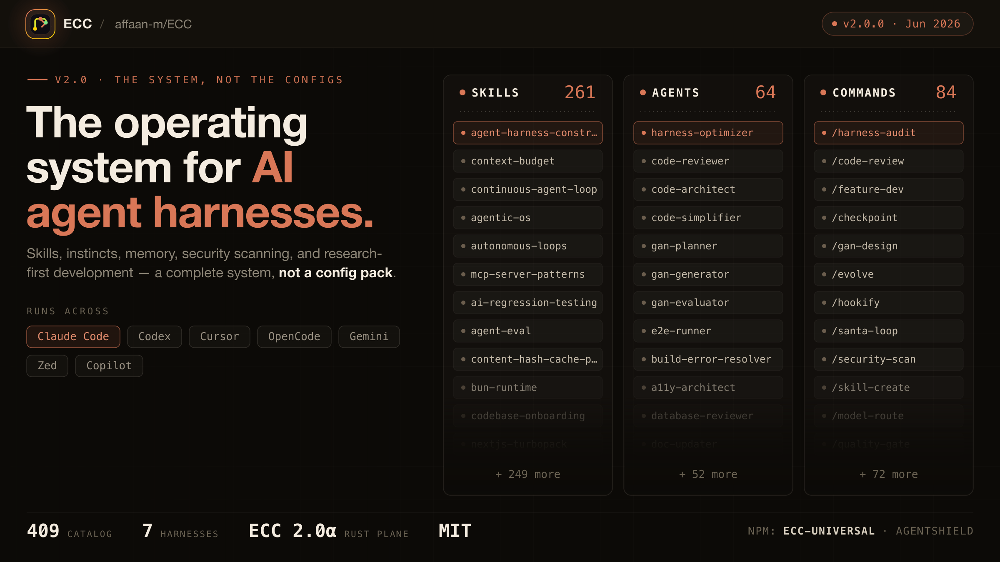

  <a href="https://ruman.sa">
    <picture>
      <source srcset="assests/H_Colored_LogoWhite@2x.png" media="(prefers-color-scheme: dark)">
      
    </picture>
  </a>

# الدليل العربي لإتقان Everything Claude Code (ECC)

هذا المستودع يحتوي على ترجمة وشرح كامل باللغة العربية لمشروع **Everything Claude Code (ECC)**. 

**ECC** هو نظام تشغيل متكامل لوكلاء الذكاء الاصطناعي (Agent Harness Operating System). يوفر هذا النظام مهارات، غرائز، إدارة متقدمة للذاكرة، فحص أمان، وتطوير يعتمد على البحث أولاً — كل ذلك لدعم مشاريعك المبنية باستخدام الذكاء الاصطناعي لتعمل بسلاسة وكفاءة.

## 🌟 ما هو هذا المستودع؟

تم إنشاء هذا المستودع لتسهيل دخول المطورين العرب إلى عالم تطوير النظم المؤتمتة عبر توفير:
- **دروس تفصيلية:** متوفرة بصيغة HTML (في مجلد `html`) وبصيغة Markdown (في مجلد `Markdown`) تتدرج من الأساسيات حتى المواضيع المتقدمة كاستخدام الوكلاء والمهارات والخطافات.
- **أدلة مترجمة:** ترجمة احترافية للأدلة الرسمية مثل الدليل المختصر، الدليل التفصيلي، ودليل الأمان.

> 🔗 **المستودع الرسمي للمشروع (GitHub Repository):**  
> [https://github.com/affaan-m/ECC/](https://github.com/affaan-m/ECC/)

---

## 📖 الأدلة المترجمة (Translated Guides)

<table>
<tr>
<td width="50%" align="center">
<a href="the-shortform-guide-ar.md">
 
<b>الدليل المختصر</b>
</a>
 الإعداد، الأسس، الفلسفة. <b>اقرأ هذا أولاً.</b>
</td>
<td width="50%" align="center">
<a href="the-longform-guide-ar.md">
 
<b>الدليل التفصيلي</b>
</a>
 تحسين الرموز، حفظ الذاكرة، التقييمات، التوازي.
</td>
</tr>
</table>

<a href="the-security-guide-ar.md">
 
<b>دليل الأمان</b>
</a>
 متجهات الهجوم، العزل، التنقية، الثغرات، AgentShield.

---

## 📚 محتويات الدروس (14 درساً)

تغطي الدورة مساراً تدريجياً يمكنك الاطلاع عليه داخل مجلد `Markdown` أو عبر فتح ملف `index.html`:

| الدرس | الوصف | Markdown | HTML |
|-------|-------|----------|------|
| 1. مقدمة إلى نظام ECC | الفرق بينه وبين النسخة العادية. | [Markdown](Markdown/lesson-01-introduction.md) | [HTML](https://htmlpreview.github.io/?https://github.com/rumanagency/ECC-arabic/blob/main/html/lesson-01-introduction.html) |
| 2. الإعداد العالمي | التبديل الاستراتيجي بين النماذج (Opus, Sonnet, Haiku). | [Markdown](Markdown/lesson-02-global-setup.md) | [HTML](https://htmlpreview.github.io/?https://github.com/rumanagency/ECC-arabic/blob/main/html/lesson-02-global-setup.html) |
| 3. هندسة المشاريع الجديدة | إنشاء مجلدات `.claude/`. | [Markdown](Markdown/lesson-03-new-projects.md) | [HTML](https://htmlpreview.github.io/?https://github.com/rumanagency/ECC-arabic/blob/main/html/lesson-03-new-projects.html) |
| 4. المشاريع الحالية (Legacy Code) | دمج نظام ECC بها. | [Markdown](Markdown/lesson-04-existing-projects.md) | [HTML](https://htmlpreview.github.io/?https://github.com/rumanagency/ECC-arabic/blob/main/html/lesson-04-existing-projects.html) |
| 5. التنمية الموجهة بالاختبارات (TDD) | إضافة ميزات جديدة. | [Markdown](Markdown/lesson-05-new-features.md) | [HTML](https://htmlpreview.github.io/?https://github.com/rumanagency/ECC-arabic/blob/main/html/lesson-05-new-features.html) |
| 6. الوكلاء (Agents) | احتراف استخدام الوكلاء المتخصصين. | [Markdown](Markdown/lesson-06-agents-mastery.md) | [HTML](https://htmlpreview.github.io/?https://github.com/rumanagency/ECC-arabic/blob/main/html/lesson-06-agents-mastery.html) |
| 7. المهارات (Skills) | إتقان استدعاء المهارات الجاهزة. | [Markdown](Markdown/lesson-07-skills-mastery.md) | [HTML](https://htmlpreview.github.io/?https://github.com/rumanagency/ECC-arabic/blob/main/html/lesson-07-skills-mastery.html) |
| 8. الخطافات (Hooks) | الغوص العميق وأتمتة المهام. | [Markdown](Markdown/lesson-08-hooks-deepdive.md) | [HTML](https://htmlpreview.github.io/?https://github.com/rumanagency/ECC-arabic/blob/main/html/lesson-08-hooks-deepdive.html) |
| 9. الوكلاء المخصصين (Custom Extensions) | بناء مهارات لفريقك. | [Markdown](Markdown/lesson-09-custom-extensions.md) | [HTML](https://htmlpreview.github.io/?https://github.com/rumanagency/ECC-arabic/blob/main/html/lesson-09-custom-extensions.html) |
| 10. أنظمة التصميم (Design Systems) | هندسة وبناء واجهات متقدمة. | [Markdown](Markdown/lesson-10-design-systems.md) | [HTML](https://htmlpreview.github.io/?https://github.com/rumanagency/ECC-arabic/blob/main/html/lesson-10-design-systems.html) |
| 11. أفضل الممارسات اللغوية | الالتزام بمعايير كل لغة برمجة. | [Markdown](Markdown/lesson-11-language-best-practices.md) | [HTML](https://htmlpreview.github.io/?https://github.com/rumanagency/ECC-arabic/blob/main/html/lesson-11-language-best-practices.html) |
| 12. دورة حياة المشاريع المتقدمة (Lifecycle) | دورة حياة المشاريع. | [Markdown](Markdown/lesson-12-project-lifecycle.md) | [HTML](https://htmlpreview.github.io/?https://github.com/rumanagency/ECC-arabic/blob/main/html/lesson-12-project-lifecycle.html) |
| 13. تعدد النماذج والوكلاء (Multi-Agent Orchestration) | لمنع التضارب. | [Markdown](Markdown/lesson-13-multi-agent-orchestration.md) | [HTML](https://htmlpreview.github.io/?https://github.com/rumanagency/ECC-arabic/blob/main/html/lesson-13-multi-agent-orchestration.html) |
| 14. لوحة التحكم الرسومية (ECC Dashboard GUI) | لوحة التحكم الرسومية. | [Markdown](Markdown/lesson-14-dashboard-gui.md) | [HTML](https://htmlpreview.github.io/?https://github.com/rumanagency/ECC-arabic/blob/main/html/lesson-14-dashboard-gui.html) |

## 📜 التراخيص وقواعد السلوك

- يتوفر هذا المشروع تحت ترخيص [MIT License](LICENSE).
- نرجو من الجميع الالتزام بـ [قواعد السلوك](CODE_OF_CONDUCT.md) الخاصة بالمجتمع.

---

## 📝 الحقوق والترجمة (Credits)

تم الشرح والترجمة بواسطة **صالح** في **وكالة رمان** (Ruman Agency).  
نلتزم بتحديث هذا الدليل والترجمة كلما تم تحديث الأداة الأصلية.

- **البريد الإلكتروني:** [hi@ruman.sa](mailto:hi@ruman.sa)
- **واتساب:** [+966539294989](https://wa.me/966539294989)
- **الموقع الإلكتروني:** [https://ruman.sa](https://ruman.sa)

