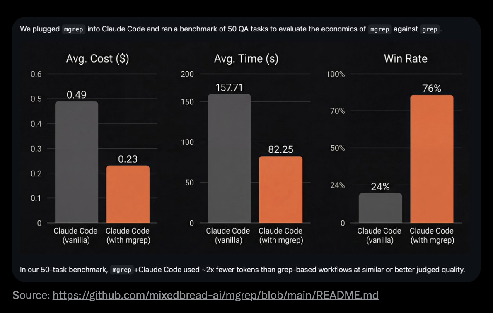

<div dir="rtl" style="text-align: right; font-family: 'IBM Plex Arabic', sans-serif;">

# الدليل المطول لـ Everything Claude Code

> ملاحظة: تمت الترجمة للحفاظ على المعنى الطبيعي قدر الإمكان. أي توضيحات إضافية فيما بعد ستُعرض بصيغة "ملاحظة المترجم:".


---

> **المتطلبات المسبقة**: هذا الدليل يبني على [الدليل المختصر لـ Everything Claude Code](./the-shortform-guide.md). اقرأه أولًا إذا لم تقم بإعداد المهارات، الخطافات، الوكلاء الفرعيين، MCPs، والإضافات.


*الدليل المختصر - اقرأه أولًا*

في الدليل المختصر، شرحت الإعدادات الأساسية: المهارات والأوامر، الخطافات، الوكلاء الفرعيون، MCPs، الإضافات، وأنماط التكوين التي تشكل العمود الفقري لسير عمل Claude Code الفعال. كان ذلك دليل الإعداد والبنية الأساسية.

يتناول هذا الدليل المطول التقنيات التي تميّز الجلسات المنتجة عن الجلسات الضائعة. إذا لم تقرأ الدليل المختصر، ارجع وأعد إعداد إعداداتك أولًا. ما يلي يفترض أن لديك مهارات ووكلاء وخطافات وMCPs معدة وتعمل.

الموضوعات هنا: اقتصاديات التوكن، الاستمرارية في الذاكرة، أنماط التحقق، استراتيجيات التوازي، والتأثيرات التراكمية لبناء سير عمل قابل لإعادة الاستخدام. هذه الأنماط طورتها على مدى أكثر من 10 أشهر من الاستخدام اليومي، وتفرّق بين الوقوع في تعفن السياق خلال الساعة الأولى، والحفاظ على جلسات إنتاجية لساعات.

كل ما نوقش في الدليلين المختصر والمطول متاح على GitHub: `github.com/affaan-m/everything-claude-code`

---

## نصائح وحيل

### بعض MCPs قابلة للاستبدال وستوفّر نافذة السياق

بالنسبة لـ MCPs مثل التحكم في الإصدار (GitHub)، قواعد البيانات (Supabase)، النشر (Vercel، Railway)، وغيرها - معظم هذه المنصات لديها CLI قوية في الواقع، وMCP هو مجرد غلاف لها. MCP لطيفة لكنها تأتي بتكلفة.

لكي تجعل CLI يعمل بشكل أقرب إلى MCP دون استخدام MCP فعليًا (وبدون إنقاص نافذة السياق)، ضع الوظائف في المهارات والأوامر. استبعد الأدوات التي يكشف عنها MCP وحولها إلى أوامر.

مثال: بدلًا من إبقاء GitHub MCP محمّلًا طوال الوقت، أنشئ أمرًا `/gh-pr` يلفّ `gh pr create` بخياراتك المفضّلة. بدلًا من أن يستهلك Supabase MCP السياق، أنشئ مهارات تستخدم CLI الخاص بـ Supabase مباشرة.

مع التحميل الكسول، تُحل قضية نافذة السياق في الغالب. لكن استخدام التوكنات والتكلفة لا تُحل بنفس الشكل. نهج CLI + المهارات يظل أسلوبًا لتحسين التوكنات.

---

## أمور مهمة

### إدارة السياق والذاكرة

لمشاركة الذاكرة عبر الجلسات، المهارة أو الأمر الذي يلخّص ويتحقق من التقدّم ثم يحفظ في ملف `.tmp` داخل مجلد `.claude` هو الحل الأفضل. في اليوم التالي يمكنه استخدام ذلك كسياق والاستمرار من حيث توقفت. أنشئ ملفًا جديدًا لكل جلسة حتى لا تلوّث السياق القديم في العمل الجديد.


*مثال على تخزين الجلسة -> <https://github.com/affaan-m/everything-claude-code/tree/main/examples/sessions>*

ينشئ Claude ملفًا يلخّص الحالة الحالية. راجعه، اطلب تعديلات إذا لزم الأمر، ثم ابدأ من جديد. في المحادثة الجديدة، قدّم مسار الملف فقط. مفيد بشكل خاص عندما تصل إلى حدود السياق وتحتاج لمواصلة عمل معقّد. يجب أن تحتوي هذه الملفات على:
- ما الأساليب التي نجحت (قابلة للتحقق بالأدلة)
- ما الأساليب التي تم تجربتها لكنها لم تنجح
- ما الأساليب التي لم تُجرَّب بعد وما المتبقّي القيام به

**تنظيف السياق بشكل استراتيجي:**

بعد أن تحدد خطتك وتُفرغ السياق (الخيار الافتراضي في وضع التخطيط في Claude Code الآن)، يمكنك العمل من الخطة. هذا مفيد عندما تتراكم الكثير من سياق الاستكشاف الذي لم يعد ذا صلة بالتنفيذ. لأجل الضغط الاستراتيجي، أوقف الضغط التلقائي. اضغط يدويًا عند الفواصل المنطقية أو أنشئ مهارة تفعل ذلك لك.

**متقدم: حقن مطالبات النظام الديناميكية**

نمط التقطته: بدلًا من وضع كل شيء فقط في CLAUDE.md (نطاق المستخدم) أو `.claude/rules/` (نطاق المشروع) الذي يحمل كل شيء في كل جلسة، استخدم أعلام CLI لحقن السياق ديناميكيًا.

```bash
claude --system-prompt "$(cat memory.md)"
```

هذا يسمح لك بأن تكون أكثر دقة حول أي سياق يُحمّل ومتى. محتوى مطالبة النظام له سلطة أعلى من رسائل المستخدم، التي لها سلطة أعلى من نتائج الأدوات.

**إعداد عملي:**

```bash
# التطوير اليومي
alias claude-dev='claude --system-prompt "$(cat ~/.claude/contexts/dev.md)"'

# وضع مراجعة PR
alias claude-review='claude --system-prompt "$(cat ~/.claude/contexts/review.md)"'

# وضع البحث / الاستكشاف
alias claude-research='claude --system-prompt "$(cat ~/.claude/contexts/research.md)"'
```

**متقدم: خطافات استمرارية الذاكرة**

هناك خطافات لا يعرفها معظم الناس تساعد في الذاكرة:

- **خطاف PreCompact**: قبل ضغط السياق، احفظ الحالة المهمة في ملف
- **خطاف Stop (نهاية الجلسة)**: عند نهاية الجلسة، دوّن الاستنتاجات في ملف
- **خطاف SessionStart**: عند بدء جلسة جديدة، حمّل السياق السابق تلقائيًا

لقد بنيت هذه الخطافات وهي موجودة في المستودع على `github.com/affaan-m/everything-claude-code/tree/main/hooks/memory-persistence`

---

### التعلم المستمر / الذاكرة

إذا اضطررت إلى تكرار مطالبة عدة مرات وواجه Claude نفس المشكلة أو أعاد عليك ردًّا سمعته سابقًا - يجب أن تُضاف تلك الأنماط إلى المهارات.

**المشكلة:** إهدار التوكنات، إهدار السياق، إهدار الوقت.

**الحل:** عندما يكتشف Claude Code شيئًا غير تافه - تقنية تصحيح خطأ، حل بديل، نمط خاص بالمشروع - احفظ تلك المعرفة كمهارة جديدة. في المرة التالية التي يظهر فيها مشكلة مشابهة، تُحمّل المهارة تلقائيًا.

لقد بنيت مهارة التعلم المستمر هذه: `github.com/affaan-m/everything-claude-code/tree/main/skills/continuous-learning`

**لماذا خطاف Stop (وليس UserPromptSubmit):**

القرار التصميمي الرئيسي هو استخدام **خطاف Stop** بدلاً من UserPromptSubmit. يعمل UserPromptSubmit على كل رسالة - ويضيف تأخيرًا لكل مطالبة. يعمل Stop مرة واحدة عند نهاية الجلسة - خفيف الوزن ولا يبطئك أثناء الجلسة.

---

### تحسين التوكنات

**الاستراتيجية الأساسية: بنية الوكلاء الفرعيين**

حسّن الأدوات التي تستخدمها والهندسة المعمارية للوكيل الفرعي المصممة لتفويض أرخص نموذج كافٍ للمهمة.

**مرجع سريع لاختيار النموذج:**


*إعداد افتراضي للوكلاء الفرعيين على مهام شائعة وأسباب الاختيارات*

| نوع المهمة                 | النموذج | لماذا                                           |
| ------------------------- | ------ | ---------------------------------------------- |
| الاستكشاف / البحث         | Haiku  | سريع، رخيص، كافٍ لإيجاد الملفات               |
| التعديلات البسيطة         | Haiku  | تغييرات في ملف واحد، تعليمات واضحة           |
| تنفيذ متعدد الملفات      | Sonnet | أفضل توازن للبرمجة                            |
| العمارة المعقدة          | Opus   | يحتاج إلى تفكير عميق                          |
| مراجعات PR                | Sonnet | يفهم السياق ويلتقط التفاصيل الدقيقة          |
| تحليل الأمان              | Opus   | لا يمكن أن تفوت الثغرات                        |
| كتابة الوثائق             | Haiku  | البنية بسيطة                                 |
| تصحيح الأخطاء المعقدة    | Opus   | يحتاج لاحتواء النظام بأكمله في الذهن          |

افترِض Sonnet لمعظم مهام الترميز بنسبة 90%. ارتقِ إلى Opus عند فشل المحاولة الأولى، أو عندما تمتد المهمة عبر 5+ ملفات، أو عند وجود قرارات معمارية، أو كود أمني حساس.

**مرجع التسعير:**


*المصدر: <https://platform.claude.com/docs/en/about-claude/pricing>*

**تحسينات خاصة بالأدوات:**

استبدال grep بـ mgrep - يقلّل التوكنات بحوالي 50% في المتوسط مقارنةً بـ grep التقليدي أو ripgrep:


*في معيارنا المكوَّن من 50 مهمة، استخدم mgrep + Claude Code نحو نصف التوكنات مقارنةً بسير عمل grep عند نفس الجودة أو أفضل. المصدر: mgrep بواسطة @mixedbread-ai*

**فوائد قاعدة الشيفرة المعيارية:**

وجود قاعدة شيفرة أكثر معيارية مع الملفات الرئيسية في مئات الأسطر بدل آلاف الأسطر يساعد في خفض تكلفة التوكنات وفي إنجاز المهمة بشكل صحيح من المحاولة الأولى.

---

### حلقات التحقق والتقييمات

**سير عمل القياس:**

قارن طلب نفس الشيء مع وبدون مهارة وفحص الفرق في النتائج:

فصّل المحادثة، ابدأ worktree جديدًا في أحدهما بدون المهارة، اعرض فرقًا في النهاية، راقب ما تم تسجيله.

**أنواع نماذج التقييم:**

- **تقييمات تعتمد على النقاط المرجعية**: ضع نقاطًا مرجعية صريحة، تحقق وفقًا للمعايير المحددة، أصلح قبل المتابعة
- **تقييمات مستمرة**: شغّل كل N دقيقة أو بعد تغييرات رئيسية، المجموعة الكاملة من الاختبارات + lint

**المقاييس الرئيسية:**

```
pass@k: ينجح أحد المحاولات على الأقل من بين k
        k=1: 70%  k=3: 91%  k=5: 97%

pass^k: يجب أن تنجح جميع المحاولات من بين k
        k=1: 70%  k=3: 34%  k=5: 17%
```

استخدم **pass@k** عندما تحتاج فقط لأن يعمل. استخدم **pass^k** عندما تكون الاتساق ضروريًا.

---

## التوازي

عند تفريع المحادثات في إعداد طرفية متعددة Claude، تأكد من أن نطاق العمل محدد جيدًا لكل إجراء في الفرع والمحادثة الأصلية. استهدف أقل تداخل ممكن عندما يتعلق الأمر بتغييرات الشيفرة.

**نمط المفضّل عندي:**

المحادثة الرئيسية لتغييرات الشيفرة، والفروع للأسئلة حول قاعدة الشيفرة وحالتها الحالية، أو البحث عن خدمات خارجية.

**حول عدد الطرفيات العشوائي:**


*Boris (Anthropic) حول تشغيل عدة مثيلات Claude*

يقدّم Boris نصائح حول التوازي. اقترح أشياء مثل تشغيل 5 مثيلات Claude محليًا و5 في السحابة. أنصح بعدم تحديد عدد طرفيات عشوائي. يجب أن تكون إضافة الطرفية بدافع الضرورة الحقيقية.

هدفك يجب أن يكون: **كم يمكنك إنجازه بأقل درجة ممكنة من التوازي.**

**Git Worktrees للمثيلات المتوازية:**

```bash
# أنشئ worktrees للعمل المتوازى
git worktree add ../project-feature-a feature-a
git worktree add ../project-feature-b feature-b
git worktree add ../project-refactor refactor-branch

# كل worktree يحصل على مثيل Claude الخاص به
cd ../project-feature-a && claude
```

إذا كنت ستبدأ في توسيع مثيلاتك ولديك عدة مثيلات Claude تعمل على شيفرة متداخلة، فمن الضروري استخدام git worktrees وأن يكون لديك خطة محددة جيدًا لكل منها. استخدم `/rename <name here>` لتسمية كل محادثة.


*الإعداد الابتدائي: الطرفية اليسرى للترميز، الطرفية اليمنى للأسئلة - استخدم /rename و /fork*

**طريقة الشلال:**

عند تشغيل عدة مثيلات Claude Code، نظمها بنمط "الشلال":

- افتح مهام جديدة في علامات تبويب نحو اليمين
- مرّر من اليسار إلى اليمين، الأقدم إلى الأحدث
- ركّز على 3-4 مهام في أقصى حد

---

## الأساس

**نمط البدء بمثيلين:**

لإدارة سير عملي الخاصة، أحب بدء مستودع فارغ مع اثنين من مثيلات Claude مفتوحة.

**المثيل 1: وكيل الإعداد**
- يضع الهيكلية والأساس
- ينشئ بنية المشروع
- يضبط الإعدادات (CLAUDE.md، القواعد، الوكلاء)

**المثيل 2: وكيل البحث العميق**
- يتصل بكل خدماتك، بحث ويب
- ينشئ PRD مفصلة
- ينشئ مخططات المعمارية mermaid
- يجمع المراجع مع مقاطع الوثائق الفعلية

**نمط llms.txt:**

إذا كان متاحًا، يمكنك العثور على `llms.txt` في العديد من مراجع الوثائق عن طريق تنفيذ `/llms.txt` عليها بمجرد الوصول إلى صفحة الوثائق. يمنحك ذلك نسخة منظَّمة ومحسّنة لـ LLM.

**الفلسفة: بناء أنماط قابلة لإعادة الاستخدام**

من @omarsar0: "في البداية، قضيت وقتًا في بناء أنماط وسير عمل قابلة لإعادة الاستخدام. متعب لبنائه، ولكنه كان له تأثير تراكمي هائل مع تحسن النماذج وأطر الوكلاء."

**ما تستثمر فيه:**

- الوكلاء الفرعيون
- المهارات
- الأوامر
- أنماط التخطيط
- أدوات MCP
- أنماط هندسة السياق

---

## أفضل الممارسات للوكلاء والوكلاء الفرعيين

**مشكلة سياق الوكيل الفرعي:**

الوكيل الفرعي موجود لتوفير السياق عن طريق إرجاع ملخّصات بدلًا من إغراق كل شيء. لكن المنسق لديه سياق دلالي يفتقده الوكيل الفرعي. الوكيل الفرعي يعرف فقط الاستعلام الحرفي، وليس الغرض وراء الطلب.

**نمط الاسترجاع التكراري:**

1. يقيّم المنسق كل نتيجة من الوكيل الفرعي
2. اسأل أسئلة متابعة قبل قبولها
3. يعود الوكيل الفرعي إلى المصدر، يحصل على الإجابات، يعيدها
4. كرر حتى تصل إلى الكفاية (حد أقصى 3 دورات)

**المفتاح:** مرّر سياق الهدف، وليس مجرد الاستعلام.

**المنسق بمراحل متسلسلة:**

```markdown
المرحلة 1: البحث (استخدم وكيل Explore) → research-summary.md
المرحلة 2: التخطيط (استخدم وكيل planner) → plan.md
المرحلة 3: التنفيذ (استخدم وكيل tdd-guide) → تغييرات الشيفرة
المرحلة 4: المراجعة (استخدم وكيل code-reviewer) → review-comments.md
المرحلة 5: التحقق (استخدم build-error-resolver عند الحاجة) → تم أو ارجع
```

**القواعد الرئيسية:**

1. يحصل كل وكيل على مدخل واحد واضح وينتج مخرجًا واحدًا واضحًا
2. تصبح المخرجات مدخلات للمرحلة التالية
3. لا تتخطى المراحل
4. استخدم `/clear` بين الوكلاء
5. خزن المخرجات الوسيطة في ملفات

---

## أمور ممتعة / ليست ضرورية لكنها مفيدة

### الشريط العلوي المخصص

يمكنك ضبطه باستخدام `/statusline` - ثم سيقول Claude إنه ليس لديك واحد لكنه يمكنه إعداده لك ويسألك ماذا تريد في هذا الشريط.

انظر أيضًا: ccstatusline (مشروع مجتمع لشريط حالة Claude Code المخصص)

### تحويل الصوت إلى نص

تحدث إلى Claude Code بصوتك. أسرع من الكتابة لكثير من الأشخاص.

- superwhisper، MacWhisper على Mac
- حتى مع أخطاء النسخ، يفهم Claude النية

### اختصارات الطرفية

```bash
alias c='claude'
alias gb='github'
alias co='code'
alias q='cd ~/Desktop/projects'
```

---

## علامة فارقة


*25,000+ نجمة على GitHub في أقل من أسبوع*

---

## الموارد

**تنسيق الوكلاء:**

- claude-flow — منصة تنظيمية بناءً على المجتمع للمؤسسات مع أكثر من 54 وكيلًا متخصصًا

**الذاكرة المتطورة ذاتيًا:**

- انظر `skills/continuous-learning/` في هذا المستودع
- rlancemartin.github.io/2025/12/01/claude_diary/ - نمط انعكاس الجلسة

**مطالعة مطالبات النظام:**

- system-prompts-and-models-of-ai-tools — تجميع المجتمع لمطالبات نظام AI (110k+ نجمة)

**رسمية:**

- Anthropic Academy: anthropic.skilljar.com

---

## المراجع

- [Anthropic: تبسيط التقييمات لوكلاء AI](https://www.anthropic.com/engineering/demystifying-evals-for-ai-agents)
- [YK: 32 نصيحة لـ Claude Code](https://agenticcoding.substack.com/p/32-claude-code-tips-from-basics-to)
- [RLanceMartin: نمط انعكاس الجلسة](https://rlancemartin.github.io/2025/12/01/claude_diary/)
- @PerceptualPeak: تفاوض سياق الوكلاء الفرعيين
- @menhguin: تصنيف تجريدي للوكلاء
- @omarsar0: فلسفة التأثيرات التراكمية

---

*كل ما تم تغطيته في كلا الدليلين متاح على GitHub في [everything-claude-code](https://github.com/affaan-m/everything-claude-code)*

</div>