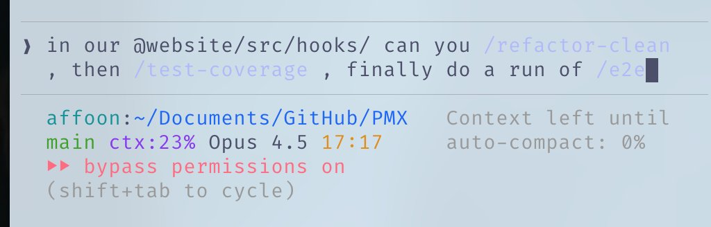
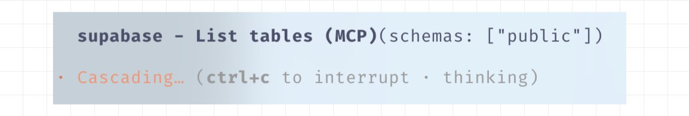

<div dir="rtl" style="text-align: right; font-family: 'IBM Plex Arabic', sans-serif;">

# الدليل المختصر لـ Everything Claude Code

> ملاحظة: تمت الترجمة للحفاظ على المعنى الطبيعي قدر الإمكان. أي توضيحات إضافية فيما بعد ستُعرض بصيغة "ملاحظة المترجم:".


---

**كنت مستخدمًا نشطًا لـ Claude Code منذ التدشين التجريبي في فبراير، وفزت في هاكاثون Anthropic x Forum Ventures مع [zenith.chat](https://zenith.chat) بجانب [@DRodriguezFX](https://x.com/DRodriguezFX) - باستخدام Claude Code فقط.**

إليكم إعدادي الكامل بعد 10 أشهر من الاستخدام اليومي: المهارات، الخطافات، الوكلاء الفرعيون، MCPs، الإضافات، وما يعمل بالفعل.

---

## المهارات والأوامر

المهارات هي الواجهة الرئيسية لسير العمل. تعمل كحزم سير عمل محددة النطاق: مطالبات قابلة لإعادة الاستخدام، هيكل، ملفات مساندة، وخرائط الكود عندما تحتاج إلى نمط تنفيذ معين.

بعد جلسة طويلة من الترميز مع Opus 4.5، تريد تنظيف الشيفرة الميتة والملفات `.md` المتروكة؟ شغّل `/refactor-clean`. بحاجة للاختبار؟ `/tdd`، `/e2e`، `/test-coverage`. هذه الأوامر الشّرطية مريحة، لكن الوحدة الدائمة الحقيقية هي المهارة الأساسية. يمكن أن تتضمن المهارات أيضًا خرائط الكود - طريقة لتمكين Claude من التنقل بسرعة في قاعدة الشيفرة دون استهلاك السياق في الاستكشاف.


*تسلسل الأوامر معًا*

لا يزال ECC يوزع طبقة `commands/`، لكنها يجب أن تُعتبر كتعويض تراثي لدخول الأوامر الشرطية أثناء الترحيل. يجب أن تعيش المنطق الدائم في المهارات.

- **المهارات**: `~/.claude/skills/` - تعريفات سير العمل الرسمية
- **الأوامر**: `~/.claude/commands/` - واجهات شرطية تراثية عندما تحتاجها

```bash
# مثال على هيكل المهارة
~/.claude/skills/
  pmx-guidelines.md      # أنماط خاصة بالمشروع
  coding-standards.md    # أفضل ممارسات اللغة
  tdd-workflow/          # مهارة متعددة الملفات مع SKILL.md
  security-review/       # مهارة قائمة على قوائم التحقق
```

---

## الخطافات

الخطافات هي أتمتة قائمة على المشغلات تعمل عند أحداث معينة. على عكس المهارات، فهي مقيدة باستدعاءات الأدوات وأحداث دورة الحياة.

**أنواع الخطافات:**

1. **PreToolUse** - قبل تنفيذ أداة (التحقق، التذكيرات)
2. **PostToolUse** - بعد انتهاء الأداة (التنسيق، حلقات الملاحظات)
3. **UserPromptSubmit** - عند إرسال رسالة
4. **Stop** - عندما ينهي Claude ردّه
5. **PreCompact** - قبل ضغط السياق
6. **Notification** - طلبات الأذونات

**مثال: تذكير tmux قبل الأوامر طويلة التشغيل**

```json
{
  "PreToolUse": [
    {
      "matcher": "tool == \"Bash\" && tool_input.command matches \"(npm|pnpm|yarn|cargo|pytest)\"",
      "hooks": [
        {
          "type": "command",
          "command": "if [ -z \"$TMUX\" ]; then echo '[Hook] Consider tmux for session persistence' >&2; fi"
        }
      ]
    }
  ]
}
```


*مثال على الملاحظات التي تحصل عليها في Claude Code أثناء تشغيل خطاف PostToolUse*

**نصيحة احترافية:** استخدم الإضافة `hookify` لإنشاء الخطافات بطريقة محادثة بدل كتابة JSON يدويًا. شغّل `/hookify` ووصف ما تريد.

---

## الوكلاء الفرعيون

الوكلاء الفرعيون هم عمليات يمكن لمنسقك (Claude الرئيسي) تفويض مهام إليها بنطاق محدود. يمكنهم العمل في الخلفية أو الواجهة، مما يوفّر السياق للوكيل الرئيسي.

تعمل الوكلاء الفرعيون بشكل جيد مع المهارات - وكيل فرعي قادر على تنفيذ مجموعة فرعية من مهاراتك يمكن تفويض المهام إليه واستخدام تلك المهارات بشكل مستقل. يمكن أيضًا حمايته بأذونات أدوات محددة.

```bash
# مثال على هيكل الوكلاء الفرعيين
~/.claude/agents/
  planner.md           # تخطيط تنفيذ الميزة
  architect.md         # قرارات تصميم النظام
  tdd-guide.md         # التطوير القائم على الاختبار
  code-reviewer.md     # مراجعة الجودة / الأمان
  security-reviewer.md # تحليل الثغرات
  build-error-resolver.md
  e2e-runner.md
  refactor-cleaner.md
```

كوّن الأدوات المسموح بها وMCPs والأذونات لكل وكيل فرعي لتحديد النطاق بشكل صحيح.

---

## القواعد والذاكرة

يحتوي مجلد `.rules` على ملفات `.md` تحتوي على أفضل الممارسات التي يجب أن يتبعها Claude دائمًا. هناك نهجان:

1. **CLAUDE.md واحد** - كل شيء في ملف واحد (على مستوى المستخدم أو المشروع)
2. **مجلد القواعد** - ملفات `.md` مكوَّمة حسب الاهتمامات

```bash
~/.claude/rules/
  security.md      # لا توجد أسرار مخزنة في الشيفرة، تحقق من المدخلات
  coding-style.md  # عدم التغيير في المكان، تنظيم الملفات
  testing.md       # سير عمل TDD، تغطية 80%
  git-workflow.md  # تنسيق الالتزام، عملية PR
  agents.md        # متى تفوض إلى الوكلاء الفرعيين
  performance.md   # اختيار النموذج، إدارة السياق
```

**أمثلة على القواعد:**

- لا تستخدم الرموز التعبيرية في قاعدة الشيفرة
- تجنّب الألوان الأرجوانية في الواجهة الأمامية
- اختبر الشيفرة دائمًا قبل النشر
- أفضّل الكود المعياري على الملفات الضخمة
- لا ترفع `console.log` إلى المستودع

---

## MCPs (بروتوكول نموذج السياق)

تربط MCPs Claude بالخدمات الخارجية مباشرة. ليست بديلاً عن واجهات الـ API - إنها غلاف يتم تشغيله بالمطالبات، مما يتيح مزيدًا من المرونة في التنقل بالمعلومات.

**مثال:** يتيح Supabase MCP لـ Claude سحب بيانات محددة، وتشغيل SQL مباشرةً دون نسخ ولصق. نفس الشيء للبنوك، ومنصات النشر، وما إلى ذلك.


*مثال على Supabase MCP يعرض الجداول داخل المخطط public*

**Chrome في Claude:** هو إضافة MCP مضمنة تتيح لـ Claude التحكم التلقائي في المتصفح - النقر لمعرفة كيف تعمل الأشياء.

**هام: إدارة نافذة السياق**

كن حذرًا مع MCPs. أحافظ على جميع MCPs في إعدادات المستخدم لكن **أوقف كل ما لا تستخدمه**. انتقل إلى `/plugins` وانتقل لأسفل أو شغّل `/mcp`.


*استخدام /plugins للتنقل بين MCPs ومراقبة الحالة الحالية*

قد تصبح نافذة السياق 200k قبل الضغط نحو 70k فقط بوجود الكثير من الأدوات. يؤثر ذلك على الأداء بشكل كبير.

**قاعدة بسيطة:** احتفظ بـ 20-30 MCP في الإعداد، لكن فعّل أقل من 10 / أقل من 80 أداة نشطة.

```bash
# تحقق من MCPs المفعلة
/mcp

# أوقف غير المستخدمين في ~/.claude/settings.json أو في .mcp.json الخاص بالمستودع الحالي
```

---

## الإضافات

الإضافات تجمع الأدوات لتسهيل التثبيت بدلًا من الإعداد اليدوي المجهد. يمكن أن تكون الإضافة مهارة + MCP معًا، أو حزم خطافات / أدوات.

**تثبيت الإضافات:**

```bash
# أضف سوقًا
# إضافة mgrep بواسطة @mixedbread-ai
claude plugin marketplace add https://github.com/mixedbread-ai/mgrep

# افتح Claude، شغّل /plugins، ابحث عن السوق الجديد، وثبّت منه
```


*عرض سوق Mixedbread-Grep المثبت حديثًا*

**إضافات LSP** مفيدة بشكل خاص إذا كنت تستخدم Claude Code خارج المحررات غالبًا. يمنحك بروتوكول خادم اللغة تدقيق نوع في الوقت الحقيقي، والانتقال إلى التعريف، وإكمالًا ذكيًا دون الحاجة لفتح بيئة تطوير متكاملة.

```bash
# مثال على الإضافات المفعلة
typescript-lsp@claude-plugins-official  # ذكاء TypeScript
pyright-lsp@claude-plugins-official     # تدقيق أنواع Python
hookify@claude-plugins-official         # إنشاء الخطافات
mgrep@Mixedbread-Grep                   # بحث أفضل من ripgrep
```

النصيحة نفسها كما مع MCPs - راقب نافذة السياق.

---

## نصائح وحيل

### اختصارات لوحة المفاتيح

- `Ctrl+U` - حذف السطر بأكمله (أسرع من الضغط على Backspace)
- `!` - بادئة سريعة لأوامر bash
- `@` - البحث عن الملفات
- `/` - بدء أوامر شرطية
- `Shift+Enter` - إدخال متعدد الأسطر
- `Tab` - تبديل عرض التفكير
- `Esc Esc` - مقاطعة Claude / استعادة الشيفرة

### سير العمل المتوازي

- **Fork** (`/fork`) - فصل المحادثات للمهام غير المتداخلة بدلًا من ملء الرسائل المعلقة
- **Git Worktrees** - للعمل مع Claudes متداخلة بدون تعارضات. كل worktree هو نسخة مستقلة.

```bash
git worktree add ../feature-branch feature-branch
# الآن شغّل مثيلات Claude منفصلة في كل worktree
```

### tmux للأوامر طويلة التشغيل

تابع سجلات الأوامر وعمليات bash التي يشغّلها Claude:

[شاهد: جلسة tmux تبث أمرًا طويلًا التشغيل (فيديو)](./assests/shortform/07-tmux-video.mp4)

```bash
tmux new -s dev
# Claude يشغّل الأوامر هنا، يمكنك الانفصال وإعادة الاتصال
tmux attach -t dev
```

### mgrep أفضل من grep

`mgrep` تحسّن كبير مقارنة بـ ripgrep/grep. ثبّته عبر سوق الإضافات، ثم استخدم مهارة `/mgrep`. يعمل مع البحث المحلي والبحث على الويب.

```bash
mgrep "function handleSubmit"  # بحث محلي
mgrep --web "Next.js 15 app router changes"  # بحث ويب
```

### أوامر مفيدة أخرى

- `/rewind` - الرجوع إلى حالة سابقة
- `/statusline` - تخصيص الشريط العلوي مع الفرع، نسبة السياق، المهام
- `/checkpoints` - نقاط التراجع على مستوى الملف
- `/compact` - تشغيل ضغط السياق يدويًا

### GitHub Actions CI/CD

أعد إعداد مراجعة الشيفرة على PRs باستخدام GitHub Actions. يمكن لـ Claude مراجعة PRs تلقائيًا عندما يتم تكوينه.


*Claude يوافق على PR إصلاح خطأ*

### الحماية

استخدم وضع الحماية للعمليات الخطرة - يعمل Claude في بيئة مقيدة دون التأثير على نظامك الفعلي.

---

## حول المحررات

اختيار المحرر يؤثر بشكل كبير على سير عمل Claude Code. بينما يعمل Claude Code من أي طرفية، العمل معه من خلال محرر متقن يفتح تتبّع الملفات في الوقت الحقيقي، التنقل السريع، وتنفيذ الأوامر المتكامل.

### Zed (تفضيلي)

أستخدم [Zed](https://zed.dev) - مكتوب بلغة Rust، لذا فهو سريع حقًا. يفتح فورًا، ويتعامل مع قواعد شيفرة ضخمة بدون تباطؤ، ولا يستهلك موارد الجهاز كثيرًا.

**لماذا Zed + Claude Code تركيبة ممتازة:**

- **السرعة** - الأداء المستند إلى Rust يعني عدم وجود تأخير عندما يقوم Claude بتحرير الملفات بسرعة. يواكب المحرر العمل.
- **تكامل لوحة الوكلاء** - يتيح تكامل Zed مع Claude تتبع تغييرات الملفات في الوقت الحقيقي أثناء تحرير Claude. ادخل إلى الملفات التي يشير إليها Claude دون مغادرة المحرر.
- **لوحة الأوامر CMD+Shift+R** - وصول سريع إلى جميع الأوامر الشرطية المخصصة، ومصححات الأخطاء، وسكربتات البناء في واجهة قابلة للبحث.
- **استخدام موارد منخفض** - لن يتنافس مع Claude على الذاكرة/المعالج أثناء العمليات الثقيلة. مهم عند تشغيل Opus.
- **وضع Vim** - دعم كامل لمفاتيح vim إذا كان هذا أسلوبك.


*محرر Zed مع قائمة الأوامر المخصصة باستخدام CMD+Shift+R. وضع المتابعة ظاهر في الزاوية اليمنى السفلية.*

**نصائح متعلقة بالمحرر بغض النظر عن النوع:**

1. **قسّم الشاشة** - الطرفية مع Claude Code على جانب، والمحرر على الجانب الآخر
2. **Ctrl + G** - افتح بسرعة الملف الذي يعمل عليه Claude حاليًا في Zed
3. **الحفظ التلقائي** - فعّل الحفظ التلقائي حتى تكون قراءات Claude للملفات حديثة دائمًا
4. **تكامل Git** - استخدم ميزات Git في المحرر لمراجعة تغييرات Claude قبل الالتزام
5. **مراقبو الملفات** - معظم المحررات تعيد تحميل الملفات المتغيرة تلقائيًا، تأكد من تمكين ذلك

### VSCode / Cursor

هذا أيضًا خيار قابل للتطبيق ويعمل جيدًا مع Claude Code. يمكنك استخدامه في وضع الطرفية أو عبر المزامنة التلقائية مع محررك باستخدام `\ide` لتمكين وظائف LSP (أصبح هذا مكررًا إلى حد ما مع الإضافات الآن). أو يمكنك اختيار الامتداد الذي يكون أكثر تكاملاً مع المحرر وله واجهة متطابقة.


*امتداد VS Code يوفر واجهة رسومية أصلية لـ Claude Code، متكاملة مباشرة في IDE الخاص بك.*

---

## إعداداتي

### الإضافات

**المثبتة:** (عادةً يكون لدي 4-5 منها مفعلة في الوقت نفسه)

```markdown
ralph-wiggum@claude-code-plugins       # أتمتة الحلقات
frontend-patterns@claude-code-plugins  # أنماط واجهة المستخدم / UX
commit-commands@claude-code-plugins    # سير عمل Git
security-guidance@claude-code-plugins  # فحوص الأمان
pr-review-toolkit@claude-code-plugins  # أتمتة PR
typescript-lsp@claude-plugins-official # ذكاء TypeScript
hookify@claude-plugins-official        # إنشاء الخطافات
code-simplifier@claude-plugins-official
feature-dev@claude-code-plugins
explanatory-output-style@claude-code-plugins
code-review@claude-code-plugins
context7@claude-plugins-official       # الوثائق الحية
pyright-lsp@claude-plugins-official    # أنواع Python
mgrep@Mixedbread-Grep                  # بحث أفضل
```

### خوادم MCP

**مضبوطة (على مستوى المستخدم):**

```json
{
  "github": { "command": "npx", "args": ["-y", "@modelcontextprotocol/server-github"] },
  "firecrawl": { "command": "npx", "args": ["-y", "firecrawl-mcp"] },
  "supabase": {
    "command": "npx",
    "args": ["-y", "@supabase/mcp-server-supabase@latest", "--project-ref=YOUR_REF"]
  },
  "memory": { "command": "npx", "args": ["-y", "@modelcontextprotocol/server-memory"] },
  "sequential-thinking": {
    "command": "npx",
    "args": ["-y", "@modelcontextprotocol/server-sequential-thinking"]
  },
  "vercel": { "type": "http", "url": "https://mcp.vercel.com" },
  "railway": { "command": "npx", "args": ["-y", "@railway/mcp-server"] },
  "cloudflare-docs": { "type": "http", "url": "https://docs.mcp.cloudflare.com/mcp" },
  "cloudflare-workers-bindings": {
    "type": "http",
    "url": "https://bindings.mcp.cloudflare.com/mcp"
  },
  "clickhouse": { "type": "http", "url": "https://mcp.clickhouse.cloud/mcp" },
  "AbletonMCP": { "command": "uvx", "args": ["ableton-mcp"] },
  "magic": { "command": "npx", "args": ["-y", "@magicuidesign/mcp@latest"] }
}
```

هذه هي النقطة الأساسية - لدي 14 MCP مضبوطة لكني أفعّل حوالي 5-6 فقط لكل مشروع. يحافظ ذلك على صحة نافذة السياق.

### الخطافات الرئيسية

```json
{
  "PreToolUse": [
    { "matcher": "npm|pnpm|yarn|cargo|pytest", "hooks": ["tmux reminder"] },
    { "matcher": "Write && .md file", "hooks": ["block unless README/CLAUDE"] },
    { "matcher": "git push", "hooks": ["open editor for review"] }
  ],
  "PostToolUse": [
    { "matcher": "Edit && .ts/.tsx/.js/.jsx", "hooks": ["prettier --write"] },
    { "matcher": "Edit && .ts/.tsx", "hooks": ["tsc --noEmit"] },
    { "matcher": "Edit", "hooks": ["grep console.log warning"] }
  ],
  "Stop": [
    { "matcher": "*", "hooks": ["check modified files for console.log"] }
  ]
}
```

### الشريط العلوي المخصص

يعرض المستخدم، الدليل، فرع git مع مؤشر التغيير، نسبة السياق المتبقية، النموذج، الوقت، وعدد المهام:


*مثال على الشريط العلوي في جذر Mac الخاص بي*

```
affoon:~ ctx:65% Opus 4.5 19:52
▌▌ plan mode on (shift+tab to cycle)
```

### هيكل القواعد

```
~/.claude/rules/
  security.md      # فحوصات الأمان الإلزامية
  coding-style.md  # عدم التغيير في المكان، حدود حجم الملف
  testing.md       # TDD، تغطية 80%
  git-workflow.md  # الالتزامات التقليدية
  agents.md        # قواعد تفويض الوكلاء الفرعيين
  patterns.md      # تنسيقات استجابات الـ API
  performance.md   # اختيار النموذج (Haiku مقابل Sonnet مقابل Opus)
  hooks.md         # توثيق الخطافات
```

### الوكلاء الفرعيون

```
~/.claude/agents/
  planner.md           # تفكيك الميزات
  architect.md         # تصميم النظام
  tdd-guide.md         # كتابة الاختبارات أولاً
  code-reviewer.md     # مراجعة الجودة
  security-reviewer.md # فحص الثغرات
  build-error-resolver.md
  e2e-runner.md        # اختبارات Playwright
  refactor-cleaner.md  # إزالة الشيفرة الميتة
  doc-updater.md       # مزامنة المستندات
```

---

## الاستنتاجات الرئيسية

1. **لا تفرّط في التعقيد** - اعتبر التكوين تحسينًا دقيقًا وليس بنية معمارية
2. **نافذة السياق ثمينة** - أوقف MCPs والإضافات غير المستخدمة
3. **التنفيذ المتوازي** - فصّل المحادثات، استخدم git worktrees
4. **أتمتة المتكرر** - الخطافات للتنسيق، linting، التذكيرات
5. **حدد نطاق الوكلاء الفرعيين** - الأدوات المحدودة = تنفيذ مركز

---

## المراجع

- [مرجع الإضافات](https://code.claude.com/docs/en/plugins-reference)
- [توثيق الخطافات](https://code.claude.com/docs/en/hooks)
- [التدقيق](https://code.claude.com/docs/en/checkpointing)
- [الوضع التفاعلي](https://code.claude.com/docs/en/interactive-mode)
- [نظام الذاكرة](https://code.claude.com/docs/en/memory)
- [الوكلاء الفرعيون](https://code.claude.com/docs/en/sub-agents)
- [نظرة عامة على MCP](https://code.claude.com/docs/en/mcp-overview)

---

**ملاحظة:** هذا جزء من التفاصيل. راجع [الدليل المطول](./the-longform-guide.md) لأنماط متقدمة.

---

*فزت في هاكاثون Anthropic x Forum Ventures في نيويورك ببناء [zenith.chat](https://zenith.chat) مع [@DRodriguezFX](https://x.com/DRodriguezFX)*

</div>